# Do it! 자료구조와 함께 배우는 알고리즘 입문 자바 편


해당 책을 공부하면서 전체적인 내용이 아닌  개인적으로 몰랐거나 필요한 내용을 정리하고 있습니다.

## 01. 기본 알고리즘

### 순서도

프로그램 순서도(program flowchart)에 사용되는 기호는 다음과 같다.

#### 데이터(Data)

- 데이터의 입력과 출력을 나타낸다.

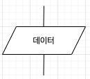

#### 처리(Process)

- 정보의 값, 자료형, 위치를 바꾸도록 정의한 연산이나 연산 집함의 실행을 나타낸다.

- 연속적인 몇가지 흐름 가운데 하나의 방향을 결정하는 연산집합이나 연산군의 실행 나타낸다.

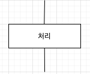

#### 미리 정의한 처리(Predefined Process)

- 서브 루틴 및 모듈 등 다른 곳에서 이미 정의한 하나 이상의 연산 또는 명령어들로 이루어진 처리를 나타낸다.

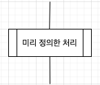

#### 판단(Decision)

- 하나의 입구와 하나 이상을 선택할 수 있는 출구가 있고, 조건을 평가하여 출구를 선택하는 판단 기능을 한다.

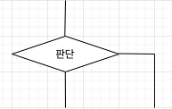

#### 루프 범위(Loop Limit)

- 두개의 기호로 이루어져있고, 루프의 시작과 종료를 나타낸다.

- 두개의 기호는 같은 이름을 사용한다.

- 루프의 시작기호(반복 전에 판단하는 경우) 또는 종료 기호(반복 후에 판단하는 경우)에 초기값, 증가값, 종료값을 표기한다.

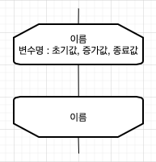

#### 선(line)

- 선은 제어의 흐름을 나타낸다.
-  주로 흐름의 방향을 분명히 나타내기 위해 화살표를 붙힌다.

#### 단말(terminator)

- 프로그램 흐름의 시작과 종료를 나타낸다.

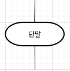

## 드모르간 법칙

''각 조건을 부정하고 논리곱을 논리합으로, 논리합을 논리곱으로 바꾸고 전체를 부정하면 원래의 조건과 같다.'

예)

- `x && y`와 `!(!x || !y)` 는 같다.
- ` x || y`와 `!(!x && !y)`는 같다.

## 02. 기본 자료구조

## 03. 검색

### 이진 검색

이진 검색은 요소가 오름차순 또는 내림차순으로 정렬되어 배열에서 검색하는 알고리즘.

검색 범위를 반씩 줄여나가며 검색한다.

```java
public class BinarySearch {

    static int binarySearch(int[] arr, int n, int key) {
        int left = 0;
        int right = n - 1;

        while (left <= right) {
            int center = (left + right) / 2;

            if (arr[center] == key) {
                return center;
            } else if (arr[center] < key) {
                left = center + 1;
            } else {
                right = center - 1;

            }
        }

        return -1;
    }
}
```

## 05. 재귀 알고리즘

### 8퀸 문제

#### 8퀸 문제란?

8퀸 문제란 8개의 퀸이 서로 공격하여 잡을 수 없도록 체스판에 배치하는 문제입니다.

- 체스판의 크기는 8*8
- 퀸은 체스판의 대각선을 포함한 모든 방향으로 어떤 위치든 직선 이동이 가능

#### 퀸을 배치하는 방법

8개의 퀸을 체스판에 배치하는 경우의 수는 체스판이 8*8 = 64 칸으로 되어있기 때문에 다음과 같습니다.

`64*63*62*61*60 ... * 57 = 178,462,987,637,760 `

보기만 해도 말도 안되는 저 경우의 수들을 어떤 조합이 조건을 만족하는지 하나하나 살펴보는 것은 상당히 비효율적입니다.

이를 해결하기 위해 규칙 두가지를 세워보도록 하겠습니다.

**[규칙 1] 각 열에 퀸을 1개만 배치한다.**

규칙 1을 적용하면 경우의 수는 `8*8*8*8*8*8*8*8=16,777,216` 개로 대폭 줄기는 했지만, 여전히 큰 수 이며 같은 행의 퀸을 공격할 수 있기 때문에 규칙 하나를 더 추가합니다.

**[규칙 2] 각 행에 퀸을 1개만 배치한다.**

#### 가지 뻗기 - 규칙 1(각 열에 퀸 1개만 배치) 만족하기

- 각 열에 1개의 퀸을 배치하는 조합을 재귀를 사용하여 나열한다.
- 아래 코드를 실행해보면 `0 0 0 0 0 0 0 0 ~ 7 7 7 7 7 7 7 7` 까지 정상적으로 모든 조합이 출력되는 것을 볼 수 있다.

```java
public class Queen {
  	//에를 들어 pos 배열이 [7,7,7,7,7,7,7,7]이면 모든 열의 퀸이 7행에 배치되어 있는 것.
    static int[] pos = new int[8]; //각 열의 퀸의 위치

    //각 열의 퀸의 위치를 출력
    static void print() {
        for (int i = 0; i < 8; i++) {
            System.out.print(pos[i] + " ");
        }
        System.out.println();
    }

    //i열에 퀸을 배치
    static void set(int i) {
        for (int j = 0; j < 8; j++) {
            pos[i] = j; //퀸을 j행에 배치
            if (i == 7) {  //모든 열에 배치 완료
                print();
            } else {
                set(i + 1); //다음 열에 퀸을 배치
            }
        }
    }

    public static void main(String[] args) {
        set(0);
    }
}
```

#### 분기 한정법 - 규칙 2(각 행에 퀸 1개만 배치) 만족하기

- 한정 조작 : 불필요한 분기를 제거하여 불필요한 조합 수를 줄이는 것.
- 분기 한정법 : 가지 뻗기와 한정 조작을 조합하여 문제를 풀어나가는 방법

- 같은 행에 퀸이 중복 배치되는 것을 방지하기 위해 flag 배열을 사용하여 체크한다.

```java
public class Queen {
    static boolean[] flag = new boolean[8]; //각 행에 퀸을 배치했는지 체크
    static int[] pos = new int[8]; //각 열의 퀸의 위치

    //각 열의 퀸의 위치를 출력
    static void print() {
        for (int i = 0; i < 8; i++) {
            System.out.print(pos[i] + " ");
        }
        System.out.println();
    }

    //i열에 퀸을 배치
    static void set(int i) {
        for (int j = 0; j < 8; j++) {
            if (!flag[j]) { //j 행에 배치된 퀸이 없다면,
                pos[i] = j; //퀸을 j행에 배치
                if (i == 7) {  //모든 열에 배치 완료
                    print();
                } else {
                    flag[j] = true;
                    set(i + 1); //다음 열에 퀸을 배치
                    flag[j] = false;
                }
            }

        }
    }

    public static void main(String[] args) {
        set(0);
    }
}
```

#### 8퀸 문제를 해결하는 프로그램

지금까지 각 퀸이 행과 열에 중복되지 않도록 배치하는 조합을 구했습니다. 하지만 퀸은 대각석으로도 이동할 수 있기 때문에 마지막으로 각 대각선에도 퀸이 중복되지 않도록 배치하는 한정 조작을 추가해야 합니다.

```java
public class Queen {
    static boolean[] flag_a = new boolean[8]; //각 행에 퀸을 배치했는지 체크
    static boolean[] flag_b = new boolean[15]; // / 대각선 방향으로 퀸을 배치했는지 체크
    static boolean[] flag_c = new boolean[15]; // \ 대각선 방향으로 퀸을 배치했는지 체크
    static int[] pos = new int[8]; //각 열의 퀸의 위치
    
    //각 열의 퀸의 위치를 출력
    static void print() {
        for (int i = 0; i < 8; i++) {
            System.out.print(pos[i] + " ");
        }
        System.out.println();
    }

    //i열에 퀸을 배치
    static void set(int i) {
        for (int j = 0; j < 8; j++) {
            // / 방향 대각선을 체크하는 배열의 인덱스는 i + j
            // \ 방향 대각선을 체크하는 배열의 인덱스는 i - j + 7
            if (!flag_a[j] && !flag_b[i + j] && !flag_c[i - j + 7]) { //j 행에 배치된 퀸이 없다면,
                pos[i] = j; //퀸을 j행에 배치
                if (i == 7) {  //모든 열에 배치 완료
                    print();
                } else {
                    flag_a[j] = flag_b[i + j] = flag_c[i - j + 7]= true;
                    set(i + 1); //다음 열에 퀸을 배치
                    flag_a[j] = flag_b[i + j] = flag_c[i - j + 7]= false;
                }
            }

        }
    }

    public static void main(String[] args) {
        set(0);
    }
}

```

코드를 실행해보면 8퀸 문제를 만족하는 92개의 조합이 출력되는 것을 볼 수 있습니다.

## 06. 정렬

### 버블 정렬

**시간 복잡도 : O(n<sup>2</sup>)**

버블 정렬은 아래 그림에서 볼 수 있듯이 인접한 두 원소의 비교를 통해 정렬을 해나가는 알고리즘입니다.

- 요소의 개수가 n개인 배열에서 n-1회 비교, 교환을 하고 나면 가장 큰 요소가 맨 뒤로 이동합니다. 이러한 일련의 비교, 교환 과정을 패스라고 합니다.

- 두번째 패스의 비교 횟수는 첫번째 패스보다 1적은 n-2회, 세번째 패스에서는 n-3회로 패스마다  1회씩 비교 횟수가 줄어듭니다. 그 이유는 각 패스마다 요소 하나씩 정렬이 완료되기 때문입니다.

- 모든 정렬이 완료되려면 n-1회의 패스가 수행되어야 합니다.

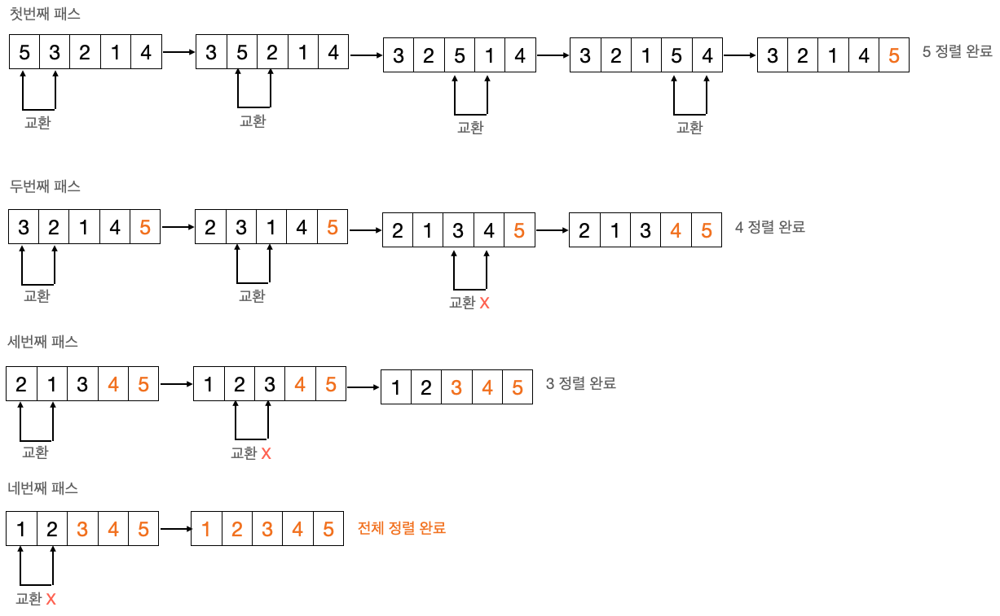

#### 소스 코드

```java
public class Main {

    private static void swap(int[] arr, int n1, int n2) {
        int temp = arr[n1];
        arr[n1] = arr[n2];
        arr[n2] = temp;
    }

    public static void bubbleSort(int[] arr, int length) {
        for (int i = 0; i < length - 1; i++) {
            for (int j = 0; j < length - i - 1; j++) {
                if (arr[j] > arr[j+1]) {
                    swap(arr, j, j+1);
                }
            }
        }
    }

    public static void main(String[] args){
        int[] arr = {2,4,6,1,5,3,6,7,8};

        bubbleSort(arr, arr.length);

        for (int i : arr) {
            System.out.print(i + " ");
        }
        
        System.out.println();
    }
}
```

#### 알고리즘 개선(1)

- 어떤 패스에서 요소의 교환 횟수가 0이면 더 이상 정렬할 요소가 없다는 뜻이기 때문에 정렬 작업을 멈추어도 됩니다.

```java
public static void bubbleSort(int[] arr, int length) {
    for (int i = 0; i < length - 1; i++) {
      	int exchange = 0; //패스의 교환 횟수
        for (int j = 0; j < length - i - 1; j++) {
            if (arr[j] > arr[j+1]) {
                swap(arr, j, j+1);
              	exchange++;
            }
        }
      	
      	if(exchange == 0) break; //교환 횟수가 0이면 종료
    }
}
```

#### 알고리즘 개선(2)

각각의 패스에서 비교, 교환을 하다가 어떤 시점 이후 교환이 수행되지 않는다면 그보다 뒤 쪽의 요소는 이미 정렬을 마친 상태라고 생각하면 됩니다.

```java
public static void bubbleSort(int[] arr, int length) {
  //arr[k]보다 뒤쪽은 정렬을 완료한 상태, 첫번째 패스에서는 모든 요소를 검사해야되기 때문에 length -1
  int k = length-1; 

  while(k > 0) {
    int lastSwap = 0;
 
    for (int i = 0; i < k; i++) {
      if (arr[i] > arr[i+1]) {
        swap(arr, i, i+1);
        lastSwap = i; //이번 패스에서 마지막 교환 위치
      }
    }

    //한 패스를 마쳤을 때, lastSwap 값을 k에 대입하여 다음에 수행할 패스의 범위를 축소한다.
    k = lastSwap; 
  }
}
```

## 단순 삽입 정렬

**시간 복잡도 : O(n<sup>2</sup>)**

단순 삽입 정렬은 정렬해야되는 요소를 기준으로 배열의 앞부분의 알맞은 위치에 삽입하는 작업을 반복하여 정렬하는 알고리즘 입니다.

배열에서 정렬할 요소의 앞부분은 정렬이 완료된 부분이고 뒷부분은 아직 정렬이 되지 않은 부분입니다. 

즉, 정렬할 요소의 인덱스가 i라면 arr[0] ~ arr[i-1]은 정렬이 완료된 요소들이고, arr[i] ~ arr[n-1]은 정렬이 아직 되지 않은 부분입니다.

두번째 요소부터 시작하는 정렬되지 않은 부분의 첫번째 요소를 정렬된 부분의 알맞은 위치에 삽입하는 작업을 n-1회 반복합니다.

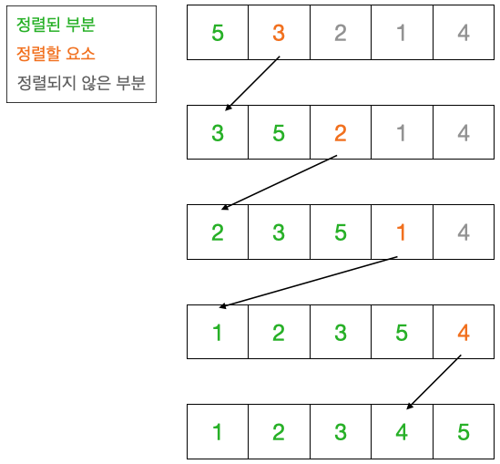

```java
public class InsertionSort {

    public static void sort(int[] arr, int n) {
        
        for (int i = 1; i < n; i++) {
            int temp = arr[i]; //정렬할 요소
            
            //정렬된 부분의 처음(인덱스 0)에 도달하거나, 
            //temp보다 작거나 같은 값을 찾을 때까지 반복한다.
            int j;
            for (j = i; j > 0 && arr[j - 1] > temp; j--) {
                arr[j] = arr[j - 1];
            }
            
            arr[j] = temp; //삽입
        }
    }
}

```

## 쉘 정렬(Shell Sort)

쉘 정렬은 삽입 정렬의 장점은 살리고 단점을 보완한  도널드 쉘(D. L. Shell)이 고안한 알고리즘으로 퀵 정렬이 고안되기 전까지 가장 빠른 알고리즘으로 알려져 있었습니다.

- 삽입 정렬의 장점 : 정렬을 마쳤거나 마친 상태에 가까울수록 정렬 속도가 빨리진다. 
- 삽입 정렬의 단점 : 삽입할 위치가 멀리 떨어져 있을수록 데이터의 이동 횟수가 많아진다.

### 쉘 정렬 과정

1. 정렬할 배열의 요소를 특정 간격을 규칙으로 나눈다.
2. 연속적이지 않은 여러 개의 부분리스트를 생성한다.
3. 각 부분리스트 별로 삽입 정렬을 진행한다.
4. 전체 리스트를 더 적은 개수의 부분 리스트로 만든 후에 1~3 과정을 수행하는 것을 부분리스트의 개수가 1개가 될 때 까지 반복한다.
5. 마지막으로 합쳐진 하나의  리스트를 대상으로 삽입 정렬을 진행한다.

부분리스트들을 합치면서 정렬을 반복하여 점점 더 정렬에 가까운 상태를 만듬으로써, 데이터의 이동을 줄이는 방법입니다.

### 쉘 정렬 예시

- 간격의 초기값은 (배열의 길이) / 2이고, 각 단계마다 간격값을 절반으로 줄여간다.
  - 간격값은 서로 배수가 되지않도록 해야 요소들이 충분히 섞여 효율적인 정렬을 기대할 수 있다. -> 간격값을 홀수로 하는 것이 좋다.
- 간격이 1이 될 때까지 즉, 하나의 리스트가 될 때까지 정렬을 반복한다.
- 간격이 n이라면 n의 간격으로 떨어진 요소들과 같은 그룹(부분 리스트)를 형성하여 n개의 그룹으로 나눈다는 의미입니다.

예를 들어 길이가 10인 `{5,4,7,3,2,8,1,9,10,6}` 배열이 있다고 가정해보겠습니다.

간격의 초기값 : `10/2 = 5`

간격 값이 5라는건 자신과 5만큼 떨어진 요소들과 같은 그룹을 형성한다는 것

1. 주어진 간격으로 그룹을 나눈다.

- {5, 8}, {4, 1}, {7, 9}, {3, 10}, {2, 6}

2. 각 그룹마다 삽입 정렬을 진행한다.

- {5, 8}, {1, 4}, {7, 9}, {3, 10}, {2, 6} -> {5, 1, 7, 3, 2, ,8, 4, 9, 10, 6}

3. 간격이 1인 경우의 정렬이 완료될 때까지 간격을 반으로 줄여가며 1~2번 과정 반복

- 5/2 = 2 이지만  짝수인 경우 +1을 해주어 3

### 쉘 정렬 소스 코드

```java
public class ShellSort {

    static void shellSort(int[] arr, int n) {

        //h : 간격
        for (int h = n / 2; h > 0; h /= 2) {

            //간격이 짝수인 경우 +1을 해서 홀수로
            if(h%2 == 0) {
                h++;
            }

            //삽입 정렬
            for (int start = 0; start < h; start++) {

                for (int j = start + h; j < n; j += h) {
                    int temp = arr[j];
                    int k;
                    for (k = j - h; k >= start && arr[k] > temp; k -= h) {
                            arr[k + h] = arr[k];
                    }
                    arr[k+h] = temp;
                }
            }
        }
    }

    public static void main(String[] args) {
        int[] arr = {5, 4, 7, 3, 2, 8, 1, 9, 10, 6};
        shellSort(arr, arr.length);
        System.out.println(Arrays.toString(arr));
    }
}

```

참고 : https://gmlwjd9405.github.io/2018/05/08/algorithm-shell-sort.html

## 퀵정렬(Quick Sort)

퀵정렬은 일반적으로 사용되고 있는 아주 빠른 정렬 알고리즘이다.

1. 피벗을 선택한다.
2. 피벗을 기준으로 좌측 그룹은  피벗보다 작은 값, 우측 그룹은 피벗보다 큰 값으로 나눈다.
3. 나눠진 각 그룹들을 대상으로 1~2 과정을 그룹의 요소 개수가 1개가 될 때까지 반복한다. 

```java
import java.util.Arrays;
import java.util.Scanner;
import java.util.Stack;

public class QuickSort {
    static void swap(int[] arr, int idx1, int idx2) {
        int temp = arr[idx1];
        arr[idx1] = arr[idx2];
        arr[idx2] = temp;
    }

    /**
     * 재귀 버전
     */
    static void quickSortRecur(int[] arr, int left, int right) {
        int pl = left;
        int pr = right;
        int pivot = arr[(pl+pr)/2];

        do {
            //왼쪽 영역에서 피벗보다 큰 값을 찾는다.
            while(arr[pl] < pivot) pl++;

            //오른쪽 영역에서 피벗보다 작은 값을 찾는다.
            while(arr[pr] > pivot) pr--;

            //왼쪽 커서가 오른쪽 커서를 넘어서지 않았다면,
            if (pl <= pr) {
                //왼쪽 커서의 요소와 오른쪽 커서의 요소를 교환한다.
                swap(arr, pl++, pr--);
            }
            //왼쪽 커서가 오른쪽 커서를 넘어서기 전까지 반복
        } while(pl <= pr);

        //나눠진 왼쪽 영역의 크기가 2이상이면 왼쪽 영역 퀵정렬 수행
        if (left < pr) quickSortRecur(arr, left, pr);

        //나눠진 오른쪽 영역의 크기가 2이상이면 오른쪽 영역 퀵정렬 수행
        if (right > pl) quickSortRecur(arr, pl, right);
    }

    /**
     * 스택 사용 버전
     */
    static void quickSortStack(int[] arr, int left, int right) {
        Stack<Integer> lstack = new Stack<>();
        Stack<Integer> rstack = new Stack<>();

        lstack.push(left);
        rstack.push(right);

        while(!lstack.isEmpty()) {
            int pl = left = lstack.pop();
            int pr = right = rstack.pop();
            int pivot = arr[(left+right)/2];

            do {
                while(arr[pl] < pivot) pl++;
                while(arr[pr] > pivot) pr--;
                if (pl <= pr) {
                    swap(arr, pl++, pr--);
                }
            } while(pl <= pr);

            if (left < pr) {
                lstack.push(left);
                rstack.push(pr);
            }

            if (pl < right) {
                lstack.push(pl);
                rstack.push(right);
            }
        }
    }

    public static void main(String[] args) {
        Scanner sc = new Scanner(System.in);

        System.out.println("퀵 정렬");
        System.out.print("요소 수:");
        int n = sc.nextInt();
        int[] arr = new int[n];

        for (int i = 0; i < n; i++) {
            System.out.print("arr[" + i + "] : ");
            arr[i] = sc.nextInt();
        }

        quickSortRecur(arr, 0, n-1);

        System.out.println("오름차순 정렬 완료");
        System.out.println(Arrays.toString(arr));
    }
}

```

### 퀵정렬 시간복잡도

퀵정렬은 배열을 조금씩 나누어 보다 작은 문제를 해결하는 과정을 반복하므로 시간복잡도는 `O(nlogn)`이다.

하지만 배열의 초깃값이나 피벗의 선택 방법에 따라 시간복잡도가 증가하는 경우가 있다.

예를 들어 매번 단 하나의 요소와 나머지 요소로 나우어지면 n번의 분할이 일어난다. 따라서 최악의 시간복잡도는 `O(n^2)`가 된다.


## 병합 정렬

병합 정렬은 배열의 앞부분과 뒷부분으로 나누어 각각 정렬한 다음 병합하는 작업을 반복하여 정렬을 수행하는 알고리즘

### 병합 정렬의 과정

if 배열의 요소가 2개 이상인 경우

1. 배열의 앞부분을 병합 정렬로 정렬
2. 배열의 뒷부분을 병합 정렬로 정렬
3. 배열의 앞부분과 뒷부분을 병합

### 병합 정렬 소스코드

```java
import java.util.Arrays;
import java.util.Scanner;

public class MergeSort {

    static int[] buff;

    //arr[left] ~ arr[right]를 재귀적으로 병합 정렬
    static void __mergeSort(int[] arr, int left, int right) {
        if (left < right) {
            int i;
            int center = (left + right) / 2;
            int p = 0;
            int j = 0;
            int k = left;

            __mergeSort(arr, left, center); //배열의 앞부분 병합 정렬
            __mergeSort(arr, center + 1, right); //배열의 뒷부분 병합 정렬

            //배열의 앞부분 arr[left] ~ arr[center]을 buff[center-left]에 복사한다.
            //for문이 끝날 때 p의 값은 복사한 요소의 개수 center - left + 1이 된다.
            for (i = left; i <= center; i++) {
                buff[p++] = arr[i];
            }

            //배열의 뒷부분 arr[center+1] ~ arr[right]과 buff로 복사한 배열 앞부분 p개를 병합한 결과를 arr에 저장한다.
            while (i <= right && j < p) {
                arr[k++] = (buff[j] <= arr[i] ? buff[j++] : arr[i++]);
            }

            //buff에 남아 있는 요소를 arr에 복사
            while (j < p) {
                arr[k++] = buff[j++];
            }
        }
    }

    static void mergeSort(int[] arr, int n) {
        buff = new int[n];

        __mergeSort(arr, 0, n - 1);

        buff = null;
    }

    public static void main(String[] args) {
        Scanner sc = new Scanner(System.in);

        System.out.println("병합 정렬");
        System.out.print("요소수 : ");
        int n = sc.nextInt();
        int[] arr = new int[n];

        for (int i = 0; i < n; i++) {
            System.out.print("arr[" + i + "] : ");
            arr[i] = sc.nextInt();
        }

        mergeSort(arr, n);

        System.out.println("오름차순으로 정렬 완료");
        System.out.println(Arrays.toString(arr));
    }
}
```

### 병합 정렬 시간 복잡도

배열 병합의 시간 복잡도는 `O(n)` 이고 요소 개수가 n개일 때, 병합 정렬의 단계는 `log n`만큼 필요하므로 전체 시간복잡도는 `O(nlogn)`이다.

# 10. 트리

## 트리 용어

- **루트** : 트리의 가장 윗부분에 위치하는 노드, 하나의 트리에는 하나의 루트가 있다.
- **리프** : 트리의 가장 아랫부분에 위치하는 노드, 더이상 뻗어나갈 수 없는 마지막에 노드가 위치한다.
- **안쪽 노드** : 루트를 포함하여 리프를 제외한 노드
- **부모** : 어떤 노드에서 가지로 연결된 위쪽 노드를 부모라고 한다. 노드는 1개의 부모 노드를 가진다.
- **형제** : 같은 부모를 가지는 노드
- **조상** : 어떤 노드에서 가지로 연결된 모든 위쪽 노드들
- **자손** : 어떤 노드에서 가지로 연결된 모든 아래쪽 노드들
- **레벨** : 루트로부터 얼마나 떨어져있는지에 대한 값. 루트의 레벨은 0, 루트로부터 가지가 하나씩 아래로 뻗을 때마다 1씩 증가
- **차수** : 노드가 갖는 자식의 수, 모든 노드의 차수가 n이하인 트리를 n진 트리라고한다.
- **높이** : 루트로부터 가장 멀리 떨어진 리프까지의 거리(리프 레벨의 최댓값)
- **서브 트리** : 트리 안에서 다시 어떤 노드를 루트로 정하고 그 자손으로 이루어진 트리
- **널 트리** : 노드, 가지가 없는 트리

## 트리 탐색

### 너비 우선 탐색(breadth-first Search)

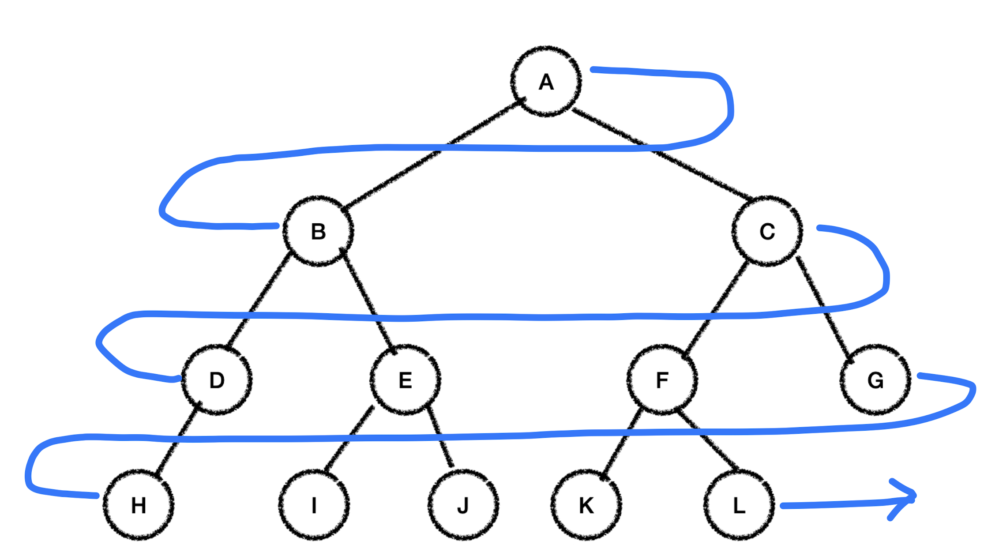

낮은 레벨에서 시작해 왼족에서 오른족 방향으로 검색하고 한 레벨에서의 검색이 끝나면 다음 레벨로 내려간다.

검색 순서 : A -> B -> C -> D -> E -> F -> G -> H -> I -> J -> K -> L

### 깊이 우선 탐색(depth-first search)

깊이 우선 탐색은 리프까지 내려가면서 검색하는 것을 우선순위로 하는 탐색 방법이다.

리프에 도달해 더 이상 검색을 진행할 곳이 없는 경우 부모에게 돌아가고, 그런 다음 다시 자식 노드로 내녀간다.

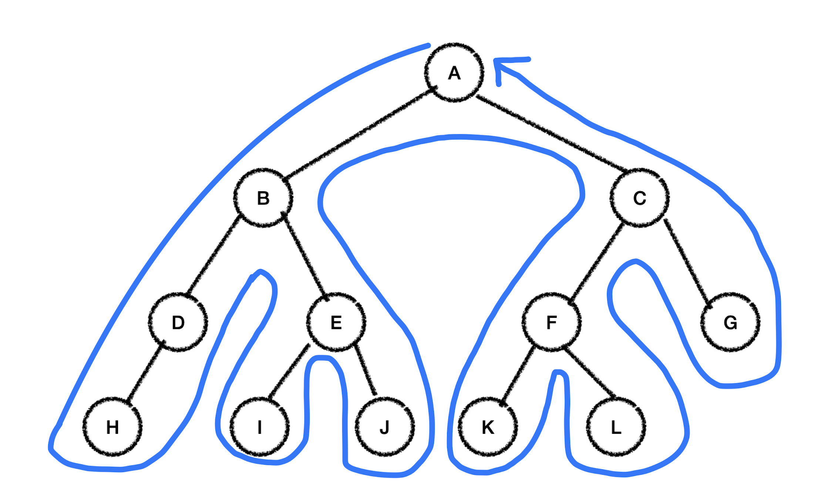

깊이 우선 탐색은 언제 노드를 방문할지에 따라 3가지로 구분한다.

### 전위 순회(Preorder)

탐색 순서 : 노드 방문 -> 왼쪽 자식 -> 오른쪽 자식

A방문 -> B로 이동 -> C로 이동

위의 예시 트리에서 전위 순회로 깊이 우선 트리를 진행하면 다음과 같은 순서로 방문한다.

A -> B -> D -> H -> E -> I -> J -> C -> F -> K -> L -> G

### 중위 순회(Inorder)

탐색 순서 : 왼쪽 자식 -> 노드 방문 -> 오른쪽 자식

B로 이동 -> A 방문 -> C로 이동

위의 예시 트리에서 중위 순회로 깊이 우선 트리를 진행하면 다음과 같은 순서로 방문한다.

H -> D -> B -> I -> E -> J -> A -> K -> F -> L -> C -> G

### 후위 순회(Postorder)

탐색 순서 : 왼쪽 자식 -> 오른쪽 자식 -> (돌아와) 노드 방문

위의 예시 트리에서 후위 순회로 깊이 우선 트리를 진행하면 다음과 같은 순서로 방문한다.

H -> D -> I -> J -> E -> B -> K -> L -> F -> G -> C -> A

## 이진 트리와 이진검색트리

### 완전이진트리

루트부터 노드가 채워져 있으면서 같은 레벨에서는 왼쪽에서 오른쪽으로 노드가 채워져있는 이진트리를 완전이진트리라고한다.

1. 마지막 레벨을 제외한 레벨은 노드를 가득 채운다.
2. 마지막 레벨은 왼쪽에서 오른쪽 방향으로 노드를 채우지만, 끝까지 채우지는 않아도 된다.

높이가 k인 완전이진트리의 노드의 최대 개수는 2<sup>k+1</sup> - 1 개 -> 따라서 n개의 노드를 저장할 수 있는 완전이진트리의 높이는 log n

### 이진검색트리

이진검색트리는 아래 조건을 만족하면 된다.

1. 어떤 노드를 기준으로 왼쪽 서브 트리의 모든 노드의 키 값은 기준 노드의 키 값보다 작아야한다.
2. 어떤 노드를 기준으로 오른쪽 서브 트리의 모든 노드의 키 값은 기준 노드의 키 값보다 커야한다.
3. 같은 키 값을 갖는 노드는 없어야한다.

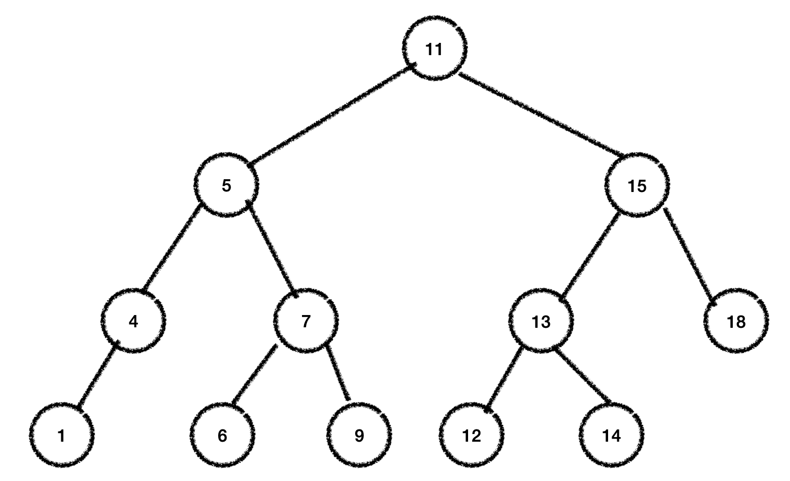

**이진 검색 트리를 중위 순회하면 다음과 같이 키 값의 오름차순으로 노드를 얻을 수 있다.**

1 -> 4 -> 5 -> 6 -> 7 -> 9 -> 11 -> 12 -> 13 -> 14 -> 15 -> 18

```java
import java.util.Comparator;

public class BinaryTree<K, V> {
    //노드
    static class Node<K, V> {
        private K key;
        private V data;
        private Node<K,V> left;
        private Node<K,V> right;

        public Node(K key, V data, Node<K, V> left, Node<K, V> right) {
            this.key = key;
            this.data = data;
            this.left = left;
            this.right = right;
        }

        K getKey() {
            return key;
        }

        V getValue() {
            return data;
        }

        void print() {
            System.out.println(data);
        }
    }

    private Node<K, V> root;
    private Comparator<? super K> comparator = null;

    public BinaryTree() {
        root = null;
    }

    public BinaryTree(Comparator<? super K> c) {
        this();
        comparator = c;
    }

    //두 키 값을 비교
    private int comp(K key1, K key2) {
        return (comparator == null) ? ((Comparable<K>)key1).compareTo(key2) : comparator.compare(key1, key2);
    }

    /*
    이진검색트리 검색 과정
    1. 루트부터 선택하여 검색을 진행. 여기서 선택하는 노드는 p
    2. 노드가 null이면 검색에 실패한다.
    3. 검색하는 값 key와 선택한 노드 p의 키 값을 비교하여
        - 값이 같으면 검색에 성공 -> 종료한다.
        - key가 작으면 선택한 노드 p에 왼쪽 자식 노드를 대입(왼쪽으로 검색 진행)
        - key가 크면 선택한 노드 p에 오른쪽 자식 노드를 대입(오른쪽으로 검색 진행)
    4. 2번 과정으로 되돌아간다.
     */
    public V search(K key) {
        Node<K, V> p = root;

        while (true) {
            if (p == null) {
                return null;
            }

            int cond = comp(key, p.getKey());

            if (cond == 0) {
                return p.getValue();
            } else if (cond < 0) { //key 쪽이 작으면
                p = p.left; //왼쪽 서브트리 탐색
            } else { //key 쪽이 크면
                p = p.right; //오른쪽 서브트리 탐색
            }
        }
    }

    /*
    이진검색트리 삽입 과정
    1. 루트를 선택한다. 여기서 선택하는 노드는 node
    2. 삽입할 키 key와 선택 노드 node의 키 값을 비교한다. 값이 같다면 삽입 실패 -> 종료
        - 값이 같지 않은 경우 key 값이 삽입할 값보다 작으면
            - 왼쪽 자식 노드가 없는 경우 노드를 삽입 후 종료
            - 왼쪽 자식 노드가 있는 경우에는 선택한 노드를 왼쪽 자식 노드로 옮긴다.
        - key 값이 삽입할 값보다 크면
            - 오른쪽 자식 노드가 없는 경우 노드를 삽입 후 종료
            - 오른쪽 자식 노드가 있는 경우에는 선택한 노드를 오른쪽 자식 노드로 옮긴다.
     */

    //node를 루트로 하는 서브 트리에 노드<K,V>를 삽입
    private void addNode(Node<K, V> node, K key, V data) {
        int cond = comp(key, node.getKey());

        if (cond == 0) {
            return;
        } else if (cond < 0) {
            if (node.left == null) {
                node.left = new Node<K, V>(key, data, null, null);
            } else {
                addNode(node.left, key, data);
            }
        } else {
            if (node.right == null) {
                node.right = new Node<K, V>(key, data, null, null);
            } else {
                addNode(node.right, key, data);
            }
        }
    }

    //노드를 삽입
    public void add(K key, V data) {
        if (root == null) {
            root = new Node<K, V>(key, data, null, null);
        } else {
            addNode(root, key, data);
        }
    }

    /*
    이진검색트리 삭제
    
    자식 노드가 없는 노드를 삭제하는 경우
    - 삭제할 노드가 부모 노드의 왼쪽 자식이면 부모의 왼쪽 포인터를 null로 한다.
    - 삭제할 노드가 부모 노드의 오른쪽 자식이면 부모의 오른쪽 포인트를 null로 한다.

    자식 노드가 1개인 노드를 삭제하는 경우
    - 삭제 대상 노드가 부모 노드의 왼쪽 자식이면 부모의 왼쪽 포인터가 삭제 대상 노드의 자식을 가리키도록 한다.
    - 삭제 대상 노드가 부모 노드의 오른쪽 자식이면 부모의 오른쪽 포인터가 삭제 대상 노드의 자식을 가리키도록 한다.

    자식 노드가 2개인 노드를 삭제하는 경우
    1. 삭제할 노드의 왼쪽 서브트리에서 키 값이 가장 큰 노드를 검색
    2. 검색한 노드를 삭제 위치로 옮긴다.(검색한 노드의 데이터를 삭제 대상 노드 위치로 복사)
    3. 옮긴 노드를 삭제
        - 옮긴 노드에 자식이 없으면 : 자식 노드가 없는 노드의 삭제 순서에 따라 노드 삭제
        - 옮긴 노드에 자식이 있으면 : 자식 노드가 1개인 노드의 삭제 순서에 따라 노드 삭제
     */
    //키 값이 key인 노드를 삭제
    public boolean remove(K key) {
        Node<K, V> p = root; //스캔 중인 노드
        Node<K, V> parent = null; //스캔 중인 노드의 부모 노드
        boolean isLeftChild = true;

        //삭제할 키를 검색. 검색에 성공하면 p는 찾은 노드, parent는 찾은 노드의 부모 노드를 참조한다.
        while (true) {
            if (p == null) {
                return false;
            }

            int cond = comp(key, p.getKey());

            if (cond == 0) { //검색 성공
                break;
            } else {
                parent = p;

                if (cond < 0) {
                    isLeftChild = true;
                    p = p.left;
                } else {
                    isLeftChild = false;
                    p = p.right;
                }
            }
        }

        //자식 노드가 없거나, 1개인 노드를 삭제하는 경우
        if (p.left == null) { //p에는 왼쪽 자식이 없음
            if (p == root) {
                root = p.right;
            } else if (isLeftChild) {
                parent.left = p.right; //부모의 왼쪽 포인터가 오른쪽 자식을 가리킴
            } else {
                parent.right = p.right; //부모의 오른쪽 포인터가 오른쪽 자식을 가리킴
            }
        } else if (p.right == null) { //p에는 오른쪽 자식이 없음
            if (p == root) {
                root = p.left;
            } else if (isLeftChild) {
                parent.left = p.left; //부모의 왼쪽 포인터가 왼쪽 자식을 가리킴
            } else {
                parent.right = p.left; //부모의 오른쪽 포인터가 왼쪽 자식을 가리킴
            }
        } else { //자식 노드가 2개인 노드를 삭제하는 경우
            parent = p;
            Node<K, V> left = p.left;
            isLeftChild = true;

            while (left.right != null) { //가장 큰 노드 left를 검색
                parent = left;
                left = left.right;
                isLeftChild = false;
            }

            p.key = left.key;
            p.data = left.data;

            if (isLeftChild) {
                parent.left = left.left;
            } else {
                parent.right = left.left;
            }
        }

        return true;
    }

    //node를 루트로 하는 서브 트리의 노드를 키 값의 오름차순으로 출력
    private void printSubTree(Node node) {
        if (node != null) {
            printSubTree(node.left);
            System.out.println(node.key + " " + node.data);
            printSubTree(node.right);
        }
    }

    //모든 노드를 키 값의 오름차순으로 출력
    public void print() {
        printSubTree(root);
    }
}
```

